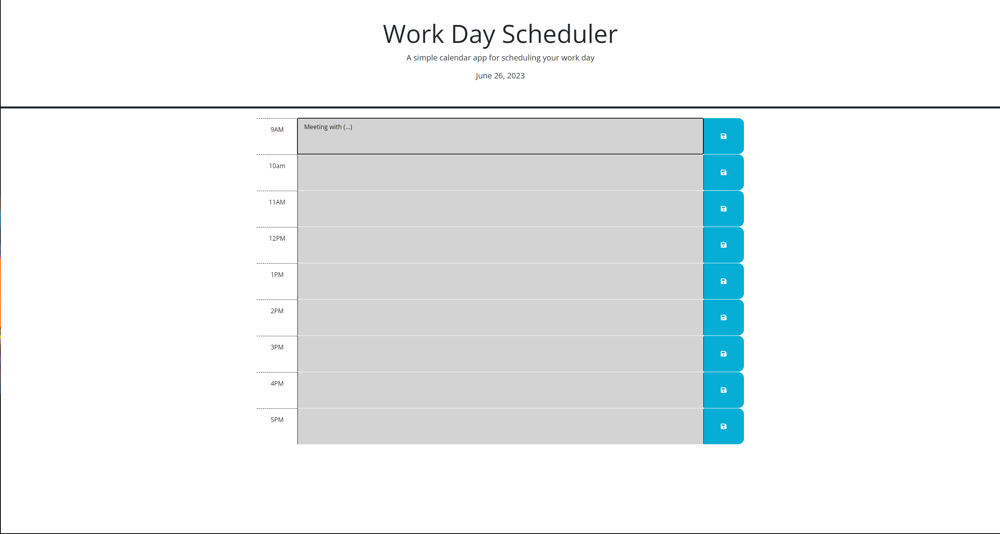
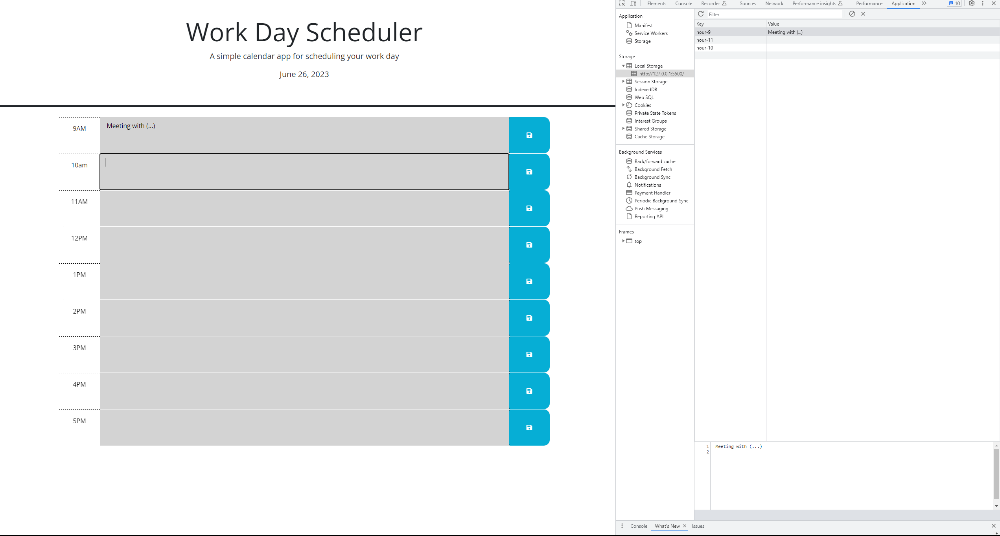

# Work-Day-Scheduler (Module5)

## Description

The app is a simple work day scheduler that allows the user to insert their inputs, while providing a visiual representation of the current time and dynamically hihlighting past, present and future. Users' inputs will be stored locally, and the work schedule will remain intact, even in the case of the page being refreshed.

url: https://mdslva.github.io/Work-Day-Scheduler/

## Credits

Completion of the project was done with the help of Tutors